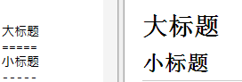
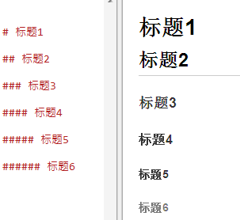
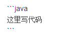
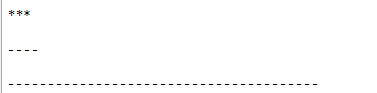
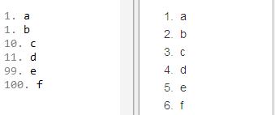

> 写静态博客一般都是用Markdown语法来写，这里就姑且记录一下Markdown语法，写博客用markdown还是很便捷的。

Markdown的语法全由一些符号所组成，易读易写。本文主要分享我平时经常使用到的Markdown语法。

<!--more-->

# 引用
## 单引用
使用符号 **>** 标记区块引用，如：
\> 零一编界，用零一编写世界。
效果如下：
> 零一编界，用零一编写世界。

## 引用内的引用
**>** 标记再使用**>>** 标记，如：
\> 零一编界
\>> 用零一编写世界。
效果如下：
> 零一编界
>> 用零一编写世界。

# 标题

1、用底线的形式，= （第一阶标题）和 - （第二阶标题），数量不限，如：

大标题  
\=====   
小标题   
\-----   


效果是截图，左边是语法，右边是效果，下同。


2、行首插入 1 到 6 个 # ，对应到标题 1 到 6 阶，如：


**常用第二种语法**。

# 链接 
\[零一编界]\(http://yvanmao.com/)   

效果如下：   
[零一编界](http://yvanmao.com/)

# 图片
\![百度]\(https://www.baidu.com/img/bd_logo1.png)  

前面的文本可不写，效果如下：


# 代码块


java代表代码语言，效果如下：
```java
public class Test {
    private int a;

    public void test(){
		a=1;
	}
}
```

# 横线
比如代码过时，会有一个横线，可用分别用两个**~**包含内容表示，~~ android:singleLine="true"~~ (并没有空格，为了演示)，效果如下：
~~android:singleLine="true"~~

# 斜体 
用一个*或__包含内容，不要演示，直接展示效果如下：

*零一编界。*

# 加粗
用两个*或__包含内容，直接展示效果如下：

**零一编界。**

# 分隔线
三个以上的星号、减号、底线来建立一个分隔线，行内不能有其他东西
  

效果如下：
***

----

---------------------------------------

# 列表
## 无序列表
使用*、+、—作为列表标记，如：

\* 零一编界  
\* 零一编界  
\* 零一编界
 
\+ 零一编界  
\+ 零一编界  
\+ 零一编界  

\- 零一编界  
\- 零一编界  
\- 零一编界  

三种写法都是如下效果：
* 零一编界


## 有序列表
只要数字接着一个英文句点，如：



# 最后
Markdown语法介绍完毕，欢迎补充。markdown其实应用范围挺广的，除了静态博客可以使用，简书上可以这种语法，用markdown写简历也能让人眼前一亮，所以有必要学一下。