最近用到文本样式相关的技能，在这里做一下用法记录和总结。实现样式的方法很多，我收录了我所知道的样式类及其用法，还包含了常用的静态和动态表情样式。如果还还发现了不错的方法，后续会补充。

文本样式使用的比较少，有写不对和不足的地方还望提点。

[查看源码](https://github.com/YvanMao/TextStyle)
## 常用参数

```java
Spanned.SPAN_EXCLUSIVE_EXCLUSIVE --- 不包含两端start和end所在的端点 (a,b)
Spanned.SPAN_EXCLUSIVE_INCLUSIVE --- 不包含端start，但包含end所在的端点 (a,b]
Spanned.SPAN_INCLUSIVE_EXCLUSIVE --- 包含两端start，但不包含end所在的端点 [a,b)
Spanned.SPAN_INCLUSIVE_INCLUSIVE--- 包含两端start和end所在的端点 [a,b]
```

## AbsoluteSizeSpan / 字体大小样式
字体大小以px为单位，用dp的话需要转  


```java
        String standard = "标准字体";
        String big = "25px字体";
        String small = "10px字体";
        Spannable spn = SpannableStringBuilder.valueOf(small + standard + big);
        AbsoluteSizeSpan ass25 = new AbsoluteSizeSpan(25);
        AbsoluteSizeSpan ass10 = new AbsoluteSizeSpan(10);
        spn.setSpan(ass10, 0, small.length(), Spannable.SPAN_INCLUSIVE_EXCLUSIVE);
        spn.setSpan(ass25, small.length() + standard.length(), small.length() + standard.length() + big.length(), Spannable.SPAN_INCLUSIVE_EXCLUSIVE);
        txtResult.setText(spn);
```
## AlignmentSpan / 对齐样式
左中右，需要textview设置成 match_parent 才看得出效果  
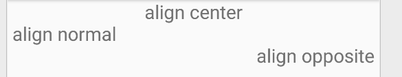

```java
        Standard asCenter = new Standard(Alignment.ALIGN_CENTER);
        Standard asNormal = new Standard(Alignment.ALIGN_NORMAL);
        Standard asOpposite = new Standard(Alignment.ALIGN_OPPOSITE);
        String strCenter = "align center\n";
        String strNormal = "align normal\n";
        String strOpposite = "align opposite";
        int l1 = strCenter.length();
        int l2 = strNormal.length();
        int l3 = strOpposite.length();
        Spannable spn = SpannableStringBuilder.valueOf(strCenter + strNormal + strOpposite);
        spn.setSpan(asCenter, 0, l1, Spannable.SPAN_INCLUSIVE_EXCLUSIVE);
        spn.setSpan(asNormal, l1, l1 + l2, Spannable.SPAN_INCLUSIVE_EXCLUSIVE);
        spn.setSpan(asOpposite, l1 + l2, l1 + l2 + l3, Spannable.SPAN_INCLUSIVE_EXCLUSIVE);
        txtResult.setText(spn);
```
## BackgroundColorSpan / 背景样式
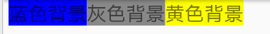

```java
        String strBgBlue = "蓝色背景";
        String strBgGray = "灰色背景";
        String strBgYellow = "黄色背景";
        int l1 = strBgBlue.length();
        int l2 = strBgGray.length();
        int l3 = strBgYellow.length();
        BackgroundColorSpan bcsBlue = new BackgroundColorSpan(Color.BLUE);
        BackgroundColorSpan bcsGray = new BackgroundColorSpan(Color.GRAY);
        BackgroundColorSpan bcsYellow = new BackgroundColorSpan(Color.YELLOW);
        Spannable spn = SpannableStringBuilder.valueOf(strBgBlue + strBgGray + strBgYellow);
        spn.setSpan(bcsBlue, 0, l1, Spannable.SPAN_INCLUSIVE_EXCLUSIVE);
        spn.setSpan(bcsGray, l1, l1 + l2, Spannable.SPAN_INCLUSIVE_EXCLUSIVE);
        spn.setSpan(bcsYellow, l1 + l2, l1 + l2 + l3, Spannable.SPAN_INCLUSIVE_EXCLUSIVE);
        txtResult.setText(spn);
```
## BulletSpan / 着重样式
会在文本前面加一个小圆点  
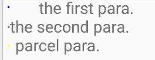

```java
        String p1 = "the first para.\n";
        String p2 = "the second para.\n";
        String p3 = "parcel para.";
        int l1 = p1.length(), l2 = p2.length(), l3 = p3.length();
        BulletSpan bs1 = new BulletSpan(100, Color.BLUE);
        BulletSpan bs2 = new BulletSpan();
        Parcel p = Parcel.obtain();
        p.writeInt(20);
        p.writeInt(1);
        p.writeInt(Color.YELLOW);
        p.setDataPosition(0);
        BulletSpan bs3 = new BulletSpan(p);
        Spannable spn = SpannableStringBuilder.valueOf(p1 + p2 + p3);
        spn.setSpan(bs1, 0, 1, Spannable.SPAN_INCLUSIVE_EXCLUSIVE);
        spn.setSpan(bs2, l1, l1 + l2, Spannable.SPAN_INCLUSIVE_EXCLUSIVE);
        spn.setSpan(bs3, l1 + l2, l1 + l2 + l3, Spannable.SPAN_INCLUSIVE_EXCLUSIVE);
        txtResult.setText(spn);
```
## DrawableMarginSpan / 图片+Margin样式
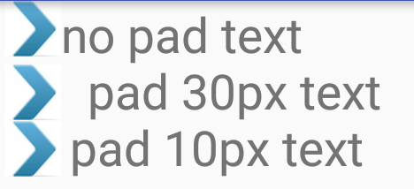

```java
        String strStart = "no pad text\n";
        String strMiddle = "pad 30px text\n";
        String strEnd = "pad 10px text";
        int l1 = strStart.length(), l2 = strMiddle.length(), l3 = strEnd.length();
        DrawableMarginSpan dms = new DrawableMarginSpan(getDrawable(R.drawable.qq1));
        DrawableMarginSpan dmsMargin = new DrawableMarginSpan(getDrawable(R.drawable.qq108), 30);
        DrawableMarginSpan dmsBottom = new DrawableMarginSpan(getDrawable(R.drawable.qq139), 10);
        Spannable spn = SpannableStringBuilder.valueOf(strStart + strMiddle + strEnd);
        spn.setSpan(dms, 0, l1, Spannable.SPAN_INCLUSIVE_INCLUSIVE);
        spn.setSpan(dmsMargin, l1, l1 + l2, Spannable.SPAN_INCLUSIVE_INCLUSIVE);
        spn.setSpan(dmsBottom, l1 + l2, l1 + l2 + l3, Spannable.SPAN_INCLUSIVE_INCLUSIVE);
        txtResult.setText(spn);
```
## ForegroundColorSpan / 字体颜色样式
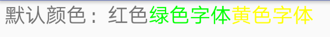

```java
        String strDefault = "默认颜色：红色";
        String strGreen = "绿色字体";
        String strOrange = "黄色字体";
        int l1 = strDefault.length(), l2 = strGreen.length(), l3 = strOrange.length();
        ForegroundColorSpan fcsGreen = new ForegroundColorSpan(Color.rgb(0x00, 0xff, 0x00));
        Parcel p = Parcel.obtain();
        p.writeInt(Color.YELLOW);
        p.setDataPosition(0);
        ForegroundColorSpan fcsYellow = new ForegroundColorSpan(p);
        Spannable spn = SpannableStringBuilder.valueOf(strDefault + strGreen + strOrange);
        spn.setSpan(fcsGreen, l1, l1 + l2, Spannable.SPAN_INCLUSIVE_INCLUSIVE);
        spn.setSpan(fcsYellow, l1 + l2, l1 + l2 + l3, Spannable.SPAN_INCLUSIVE_INCLUSIVE);
        txtResult.setText(spn);
```
## ImageSpan / 图片样式


```java
        String text = "Android*一词的本义*指“机器人”*。Google*";
        Bitmap bm = ((BitmapDrawable) getDrawable(R.drawable.qq1)).getBitmap();
        Drawable d = getDrawable(R.drawable.qq108);
        d.setBounds(0, 0, (int) txtResult.getTextSize(), (int) txtResult.getTextSize());
        Uri uri = Uri.parse("android.resource://" + getPackageName() + "/" + R.drawable.qq139);
        ImageSpan is1 = new ImageSpan(this, bm, ImageSpan.ALIGN_BASELINE);
        ImageSpan is2 = new ImageSpan(d, ImageSpan.ALIGN_BASELINE);
        ImageSpan is3 = new ImageSpan(this, R.drawable.qq139);
        ImageSpan is4 = new ImageSpan(this, uri, ImageSpan.ALIGN_BASELINE);
        Spannable spn = SpannableStringBuilder.valueOf(text);
        spn.setSpan(is1, 7, 8, Spannable.SPAN_EXCLUSIVE_EXCLUSIVE);
        spn.setSpan(is2, 13, 14, Spannable.SPAN_INCLUSIVE_EXCLUSIVE);
        spn.setSpan(is3, 20, 21, Spannable.SPAN_EXCLUSIVE_EXCLUSIVE);
        spn.setSpan(is4, 28, 29, Spannable.SPAN_EXCLUSIVE_EXCLUSIVE);
        txtResult.setText(spn);
```
## LeadingMarginSpan / 文本缩进的样式
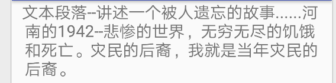

```java
        String s1 = "文本段落--讲述一个被人遗忘的故事......";
        String s2 = "河南的1942--悲惨的世界，无穷无尽的饥饿和死亡。";
        String s3 = "灾民的后裔，我就是当年灾民的后裔。";
        int l1 = s1.length(), l2 = s2.length(), l3 = s3.length();
        Parcel p = Parcel.obtain();
        p.writeInt(20);
        p.writeInt(30);
        p.setDataPosition(0);
        LeadingMarginSpan.Standard lms = new LeadingMarginSpan.Standard(p);
        Spannable spn = SpannableStringBuilder.valueOf(s1 + s2 + s3);
        spn.setSpan(lms, 0, l1 + l2 + l3, Spannable.SPAN_EXCLUSIVE_EXCLUSIVE);
        txtResult.setText(spn);
```
## MaskFilter / 滤镜样式
BlurMaskFilter ,指定了一个模糊的样式和半径来处理Paint的边缘
EmbossMaskFilter ,在android4.0以上已经无效了,我android7.0上直接显示空白。


```java
        String s1 = "MaskFilterSpan";
        String s2 = "究竟应该如何使用？";
        int l1 = s1.length(), l2 = s2.length();
        MaskFilter mfBlur = new BlurMaskFilter(4, BlurMaskFilter.Blur.OUTER);
        MaskFilter mfEmboss = new EmbossMaskFilter(new float[]{10, 10, 10}, 0.1f, 5f, 5f);
        MaskFilterSpan mfsBlur = new MaskFilterSpan(mfBlur);
        MaskFilterSpan mfsEmboss = new MaskFilterSpan(mfEmboss);
        Spannable spn = SpannableStringBuilder.valueOf(s1 + s2);
        spn.setSpan(mfsBlur, 0, l1, Spannable.SPAN_INCLUSIVE_INCLUSIVE);
        spn.setSpan(mfsEmboss, l1, l1 + l2, Spannable.SPAN_EXCLUSIVE_EXCLUSIVE);
        txtResult.setText(spn);
```
## QuoteSpan / 引用样式
自带的引用样式是一条竖线，引号是通过 字体大小样式 和 字体颜色样式组合实现的

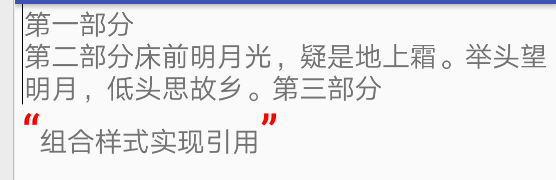

```java
        String part1 = "第一部分\n";
        String part2 = "第二部分床前明月光，疑是地上霜。举头望明月，低头思故乡。";
        String part3 = "第三部分\n";
        String part4 = "“组合样式实现引用”";
        int l1 = part1.length(), l2 = part2.length(), l3 = part3.length(), l4 = part4.length();
        Parcel p = Parcel.obtain();
        p.writeInt(Color.BLACK);
        p.setDataPosition(0);
        QuoteSpan qs = new QuoteSpan(p);
        Spannable spn = SpannableStringBuilder.valueOf(part1 + part2 + part3 + part4);
        spn.setSpan(qs, 0, l1 + l2 + l3, Spannable.SPAN_INCLUSIVE_EXCLUSIVE);

        spn.setSpan(new AbsoluteSizeSpan(100), spn.length()-l4, spn.length()-l4+1, Spannable.SPAN_INCLUSIVE_EXCLUSIVE);
        spn.setSpan(new ForegroundColorSpan(Color.RED), spn.length()-l4, spn.length()-l4+1, Spannable.SPAN_INCLUSIVE_EXCLUSIVE);
        spn.setSpan(new AbsoluteSizeSpan(100), spn.length()-1 , spn.length(), Spannable.SPAN_INCLUSIVE_EXCLUSIVE);
        spn.setSpan(new ForegroundColorSpan(Color.RED), spn.length()-1 , spn.length(), Spannable.SPAN_INCLUSIVE_EXCLUSIVE);
        //必须重新new一个span对象，不然前面的无效

        txtResult.setText(spn);
```
## RelativeSizeSpan / 相对大小样式
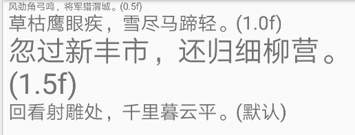

```java
        String sentence1 = "风劲角弓鸣，将军猎渭城。(0.5f)\n";
        String sentence2 = "草枯鹰眼疾，雪尽马蹄轻。(1.0f)\n";
        String sentence3 = "忽过新丰市，还归细柳营。(1.5f)\n";
        String sentence4 = "回看射雕处，千里暮云平。(默认)";
        int l1 = sentence1.length(), l2 = sentence2.length(), l3 = sentence3.length();
        RelativeSizeSpan rss1 = new RelativeSizeSpan(0.5f);
        RelativeSizeSpan rss2 = new RelativeSizeSpan(1.0f);
        Parcel p = Parcel.obtain();
        p.writeFloat(1.5f);
        p.setDataPosition(0);
        RelativeSizeSpan rss3 = new RelativeSizeSpan(p);
        Spannable spn = SpannableStringBuilder.valueOf(sentence1 + sentence2 + sentence3 + sentence4);
        spn.setSpan(rss1, 0, l1, Spannable.SPAN_EXCLUSIVE_EXCLUSIVE);
        spn.setSpan(rss3, l1 + l2, l1 + l2 + l3, Spannable.SPAN_EXCLUSIVE_EXCLUSIVE);
        txtResult.setText(spn);
```
## ScaleXSpan / 横向缩放样式
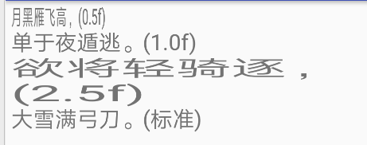

```java
        String sentence1 = "月黑雁飞高，(0.5f)\n";
        String sentence2 = "单于夜遁逃。(1.0f)\n";
        String sentence3 = "欲将轻骑逐，(2.5f)\n";
        String sentence4 = "大雪满弓刀。(标准)";
        int l1 = sentence1.length(), l2 = sentence2.length(), l3 = sentence3.length();
        ScaleXSpan rss1 = new ScaleXSpan(0.5f);
        ScaleXSpan rss2 = new ScaleXSpan(1.0f);
        Parcel p = Parcel.obtain();
        p.writeFloat(2.5f);
        p.setDataPosition(0);
        ScaleXSpan rss3 = new ScaleXSpan(p);
        Spannable spn = SpannableStringBuilder.valueOf(sentence1 + sentence2 + sentence3 + sentence4);
        spn.setSpan(rss1, 0, l1, Spannable.SPAN_EXCLUSIVE_EXCLUSIVE);
        spn.setSpan(rss2, l1, l1 + l2, Spannable.SPAN_EXCLUSIVE_EXCLUSIVE);
        spn.setSpan(rss3, l1 + l2, l1 + l2 + l3, Spannable.SPAN_EXCLUSIVE_EXCLUSIVE);
        txtResult.setText(spn);
```
## StrikethroughSpan / 删除线样式
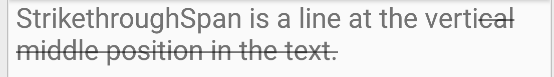

```java
        String sentence = "StrikethroughSpan is a line at the vertical middle position in the text.";
        int l1 = sentence.length();
        StrikethroughSpan ss = new StrikethroughSpan();
        Spannable spn = SpannableStringBuilder.valueOf(sentence);
        spn.setSpan(ss, 40, l1, Spannable.SPAN_EXCLUSIVE_EXCLUSIVE);
        txtResult.setText(spn);
```
## StyleSpan / 字体风格样式
主要是加粗，斜体


```java
        String sentence = "StyleSpan set the style of the text.";
        int l1 = sentence.length();
        StyleSpan ssBold = new StyleSpan(Typeface.BOLD);
        StyleSpan ssItalic = new StyleSpan(Typeface.ITALIC);
        Parcel p = Parcel.obtain();
        p.writeInt(Typeface.BOLD_ITALIC);
        p.setDataPosition(0);
        StyleSpan ssBI = new StyleSpan(p);
        Spannable spn = SpannableStringBuilder.valueOf(sentence);
        spn.setSpan(ssBold, 10, 18, Spannable.SPAN_EXCLUSIVE_EXCLUSIVE);
        spn.setSpan(ssItalic, 18, 26, Spannable.SPAN_EXCLUSIVE_EXCLUSIVE);
        spn.setSpan(ssBI, 26, l1, Spannable.SPAN_EXCLUSIVE_EXCLUSIVE);
        txtResult.setText(spn);
```
## SubscriptSpan / 下标样式
如化学元素的角标

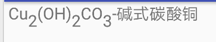

```java
        String text = "Cu2(OH)2CO3-碱式碳酸铜";
        Spannable spn = SpannableStringBuilder.valueOf(text);
        spn.setSpan(new SubscriptSpan(), 2, 3, Spannable.SPAN_EXCLUSIVE_EXCLUSIVE);
        spn.setSpan(new SubscriptSpan(), 7, 8, Spannable.SPAN_EXCLUSIVE_EXCLUSIVE);
        spn.setSpan(new SubscriptSpan(), 10, 11, Spannable.SPAN_EXCLUSIVE_EXCLUSIVE);
        txtResult.setText(spn);
```
## SuperscriptSpan / 上标样式
如数学的平方公式

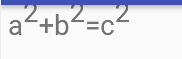

```java
        String text = "a2+b2=c2";
        Spannable spn = SpannableStringBuilder.valueOf(text);
        spn.setSpan(new SuperscriptSpan(), 1, 2, Spannable.SPAN_EXCLUSIVE_EXCLUSIVE);
        spn.setSpan(new SuperscriptSpan(), 4, 5, Spannable.SPAN_EXCLUSIVE_EXCLUSIVE);
        spn.setSpan(new SuperscriptSpan(), 7, 8, Spannable.SPAN_EXCLUSIVE_INCLUSIVE);
        txtResult.setText(spn);
```
## TabStopSpan / 制表位偏移样式
感觉区别不是很大

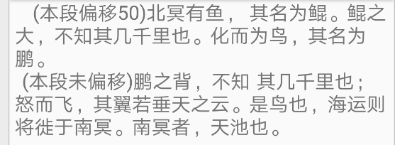

```java
        String para1 = "\t(本段偏移50)北冥有鱼，\t其名为鲲。鲲之大，不知其几千里也。化而为鸟，其名为鹏。\r\n";
        String para2 = "\t(本段未偏移)鹏之背，不知\t其几千里也；怒而飞，其翼若垂天之云。是鸟也，海运则将徙于南冥。" + "南冥者，天池也。 ";
        TabStopSpan.Standard tss = new TabStopSpan.Standard(50);
        Spannable spn = SpannableStringBuilder.valueOf(para1 + para2);
        spn.setSpan(tss, 0, para1.length(), Spannable.SPAN_EXCLUSIVE_EXCLUSIVE);
        txtResult.setText(spn);
```
## TextAppearanceSpan / style文件定义样式
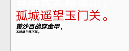

通过xml配置来处理文本样式

```java
        String para1 = "青海长云暗雪山，\n";
        String para2 = "孤城遥望玉门关。\n";
        String para3 = "黄沙百战穿金甲，\n";
        String para4 = "不破楼兰终不还。";
        int l1 = para1.length(), l2 = para2.length(), l3 = para3.length(), l4 = para4.length();
        TextAppearanceSpan tas1 = new TextAppearanceSpan(this, android.R.style.TextAppearance_StatusBar_EventContent_Title);
        TextAppearanceSpan tas2 = new TextAppearanceSpan(this, R.style.style_red, -1);
        ColorStateList colorlist = null, colorlistLink = null;
        try {
            colorlist = ColorStateList.createFromXml(getResources(), getResources().getXml(R.xml.colorlist));
            colorlistLink = ColorStateList.createFromXml(getResources(), getResources().getXml(R.xml.colorlistlink));
        } catch (XmlPullParserException e) {
            e.printStackTrace();
        } catch (IOException e) {
            e.printStackTrace();
        }
        TextAppearanceSpan tas3 = new TextAppearanceSpan("NORMAL", Typeface.BOLD_ITALIC, 20, colorlist, colorlistLink);
        Parcel p = Parcel.obtain();
        p.writeString("SERIF");
        p.writeInt(Typeface.BOLD_ITALIC);
        p.writeInt(10);
        p.writeInt(1);
        colorlist.writeToParcel(p, Parcelable.PARCELABLE_WRITE_RETURN_VALUE);
        p.writeInt(1);
        colorlist.writeToParcel(p, Parcelable.PARCELABLE_WRITE_RETURN_VALUE);
        p.setDataPosition(0);
        TextAppearanceSpan tas4 = new TextAppearanceSpan(p);
        Spannable spn = SpannableStringBuilder.valueOf(para1 + para2 + para3 + para4);
        spn.setSpan(tas1, 0, l1, Spannable.SPAN_EXCLUSIVE_EXCLUSIVE);
        spn.setSpan(tas2, l1, l1 + l2, Spannable.SPAN_EXCLUSIVE_EXCLUSIVE);
        spn.setSpan(tas3, l1 + l2, l1 + l2 + l3, Spannable.SPAN_EXCLUSIVE_EXCLUSIVE);
        spn.setSpan(tas4, l1 + l2 + l3, l1 + l2 + l3 + l4, Spannable.SPAN_EXCLUSIVE_EXCLUSIVE);
        txtResult.setText(spn);
```
## TypefaceSpan / 字体样式
默认只支持android自带的三种字体，要用其他字体需要重写一个 TpyefaceSpan 这个类

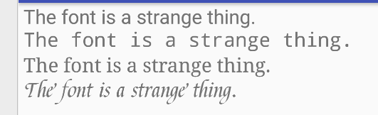

```java
        String text1 = "The font is a strange thing.\n";
        String text2 = "The font is a strange thing.\n";
        String text3 = "The font is a strange thing.\n";
        String text4 = "The font is a strange thing.";
        int l1 = text1.length(), l2 = text2.length(), l3 = text3.length(), l4 = text4.length();
        TypefaceSpan tsSANS_SERIF = new TypefaceSpan("sans_serif");
        TypefaceSpan tsMONOSPACE = new TypefaceSpan("monospace");
        Parcel p = Parcel.obtain();
        p.writeString("serif");
        p.setDataPosition(0);
        TypefaceSpan tsSERIF = new TypefaceSpan(p);
        Typeface typeface = Typeface.createFromAsset(getAssets(), "font.ttf");
        MyTypefaceSpan typeFont = new MyTypefaceSpan(typeface);

        Spannable spn = SpannableStringBuilder.valueOf(text1 + text2 + text3 + text4);
        spn.setSpan(tsSANS_SERIF, 0, l1, Spannable.SPAN_EXCLUSIVE_EXCLUSIVE);
        spn.setSpan(tsMONOSPACE, l1, l1 + l2, Spannable.SPAN_EXCLUSIVE_EXCLUSIVE);
        spn.setSpan(tsSERIF, l1 + l2, l1 + l2 + l3, Spannable.SPAN_EXCLUSIVE_EXCLUSIVE);
        spn.setSpan(typeFont, l1 + l2 + l3, l1 + l2 + l3 + l4, Spannable.SPAN_EXCLUSIVE_EXCLUSIVE);
        txtResult.setText(spn);
```
## UnderlineSpan / 下划线样式
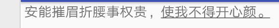

```java
        String sentence1 = "安能摧眉折腰事权贵，";
        String sentence2 = "使我不得开心颜。";
        int l1 = sentence1.length(), l2 = sentence2.length();
        UnderlineSpan us = new UnderlineSpan();
        Spannable spn = SpannableStringBuilder.valueOf(sentence1 + sentence2);
        spn.setSpan(us, l1, l1 + l2, Spannable.SPAN_EXCLUSIVE_EXCLUSIVE);
        txtResult.setText(spn);
```
## URLSpan / 超链接样式
超链接样式，点击文本可以跳转到网页


```java
        String text = "点击这里看到哪儿去...再点击这里看看呢？";
        URLSpan us = new URLSpan("http://www.baidu.com");
        Parcel p = Parcel.obtain();
        p.writeString("http://www.sina.com.cn");
        p.setDataPosition(0);
        URLSpan us2 = new URLSpan(p);
        Spannable spn = SpannableStringBuilder.valueOf(text);
        spn.setSpan(us, 2, 4, Spannable.SPAN_EXCLUSIVE_EXCLUSIVE);
        spn.setSpan(us2, 15, 17, Spannable.SPAN_EXCLUSIVE_EXCLUSIVE);
        //txtResult.setMovementMethod(LinkMovementMethod.getInstance());
        txtResult.setText(spn);
```
## Html.fromHtml / Html样式
Html.fromHtml 返回的也是一个 Spaned 样式对象，主要用来把html标签转化为对应的文本样式，但只支持部分标签。图标标签没法直接解析，需要使用 Html.ImageGetter ,在 getDrawable 中处理图片，下面例子还实现了gif表情，需要的可以查看源代码。

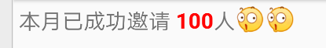

```java
        String textStr = "本月已成功邀请 <strong><font color='#FF0000'>" + 100 + "</font></strong>人";
        String imgStr = "</br></br></br>";
        Spanned spn = Html.fromHtml(textStr + imgStr, new Html.ImageGetter() {
            @Override
            public Drawable getDrawable(String source) {
                if (source.endsWith(".gif")) {
                    GifDrawalbe drawable = new GifDrawalbe(getApplicationContext(), imgMap.get(source));
                    //drawable.addListen(this);
                    drawables.add(drawable);
                    return drawable;
                } else {
                    Drawable drawable = getResources().getDrawable(imgMap.get(source).intValue());
                    drawable.setBounds(0, 0, drawable.getIntrinsicWidth(), drawable.getIntrinsicHeight());
                    return drawable;
                }
            }
        }, null);
        txtResult.setText(spn);
```

[查看源码](https://github.com/YvanMao/TextStyle)